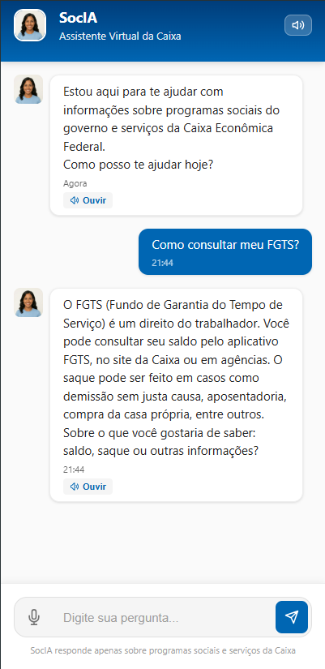
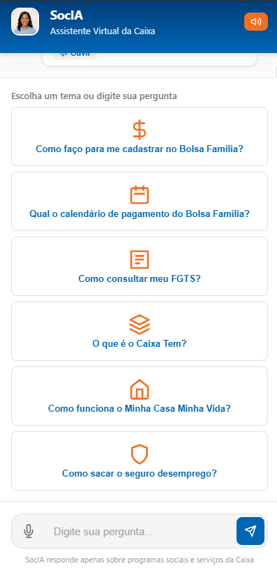
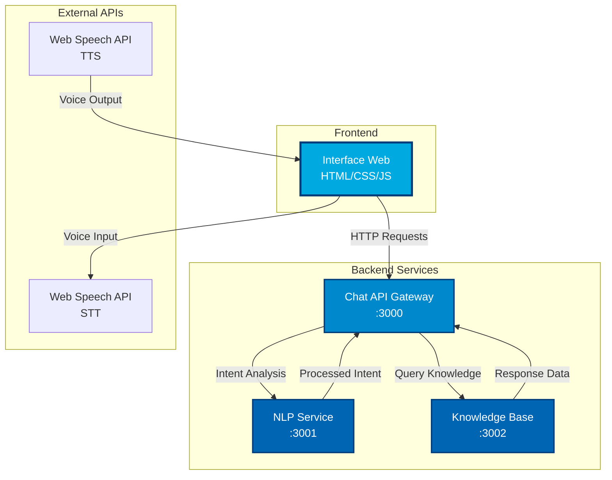
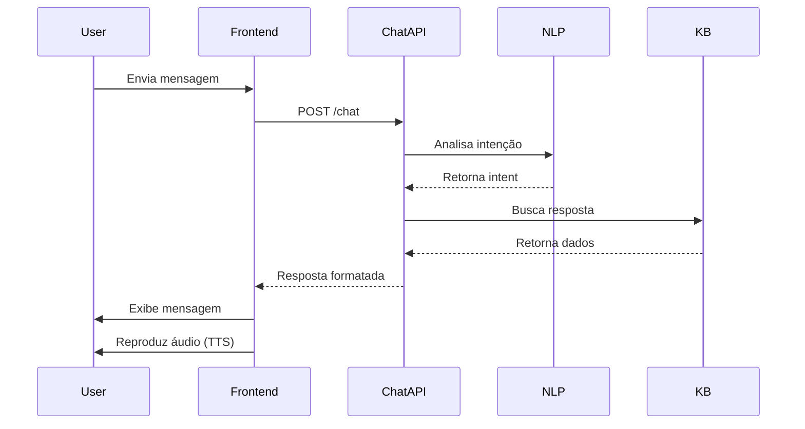

# 🤖 SocIA - Assistente Virtual da Caixa Econômica Federal

<div align="center">


**Chatbot Inteligente para Programas Sociais e Serviços Bancários**

[](https://opensource.org/licenses/MIT)
[](https://developer.mozilla.org/en-US/docs/Web/HTML)
[](https://developer.mozilla.org/en-US/docs/Web/CSS)
[](https://developer.mozilla.org/en-US/docs/Web/JavaScript)
[](https://nodejs.org/)

[Demo](#-demonstração) • [Funcionalidades](#-funcionalidades) • [Instalação](#-instalação) • [Documentação](#-documentação) • [Arquitetura](#-arquitetura)

</div>

---

## 📋 Índice

- [Sobre o Projeto](#-sobre-o-projeto)
- [Funcionalidades](#-funcionalidades)
- [Demonstração](#-demonstração)
- [Tecnologias](#-tecnologias)
- [Arquitetura](#-arquitetura)
- [Instalação](#-instalação)
- [Uso](#-uso)
- [Configuração](#-configuração)
- [API e Integrações](#-api-e-integrações)
- [Roadmap](#-roadmap)
- [Contribuindo](#-contribuindo)
- [Licença](#-licença)
- [Contato](#-contato)

---

## 🎯 Sobre o Projeto

**SocIA** é um assistente virtual inteligente desenvolvido para a Caixa Econômica Federal, especializado em fornecer informações sobre **programas sociais do governo federal** e **serviços bancários da Caixa**. O projeto combina uma interface moderna e acessível com tecnologias de ponta em processamento de linguagem natural e síntese de voz.

### 🎨 Design e Identidade Visual

O SocIA foi desenvolvido seguindo rigorosamente a identidade visual da Caixa Econômica Federal:

- **Paleta de Cores**: Degradês azuis oficiais (#003D7A, #0066B3, #0088CC, #00A9E0, #00C4E8)
- **Tipografia**: Fontes modernas e legíveis (Inter, Roboto)
- **Efeitos**: Glassmorphism, gradientes complexos, micro-animações
- **Responsividade**: Design adaptativo para desktop, tablet e mobile

### 🧠 Inteligência e Personalidade

A SocIA possui uma persona humanizada e profissional:

- **Tom**: Amigável, pausado e acolhedor
- **Gênero**: Feminino
- **Escopo**: Focado exclusivamente em programas sociais e serviços da Caixa
- **Comportamento**: Empático, claro e orientado a soluções

---

## ✨ Funcionalidades

### 🎤 Recursos de Voz

- **Text-to-Speech (TTS)**
  - Voz feminina em português brasileiro (Microsoft Francisca)
  - Parâmetros otimizados: rate 0.95, pitch 1.15, volume 0.95
  - Botão "Ouvir" em cada mensagem do bot
  - Toggle para ativar/desativar voz

- **Speech-to-Text (STT)**
  - Reconhecimento de voz em tempo real
  - Transcrição automática para o campo de input
  - Feedback visual durante gravação
  - Suporte a português brasileiro

### 💬 Interface Conversacional

- **Ações Rápidas**: 6 tópicos pré-definidos
  - Como faço para me cadastrar no Bolsa Família?
  - Qual o calendário de pagamento do Bolsa Família?
  - Como consultar meu FGTS?
  - O que é o Caixa Tem?
  - Como funciona o Minha Casa Minha Vida?
  - Como sacar o seguro desemprego?

- **Chat Inteligente**
  - Respostas contextualizadas e personalizadas
  - Indicador de digitação
  - Histórico de conversação
  - Auto-scroll para novas mensagens

### 🎨 Design Premium

- **Efeitos Visuais**
  - Glassmorphism em cards e botões
  - Gradientes animados
  - Texturas sutis em camadas
  - Sombras múltiplas
  - Bordas com gradiente

- **Animações**
  - Fade-in para mensagens
  - Slide-up para ações rápidas
  - Pulse para botões ativos
  - Shimmer no título
  - Glow no avatar

### ♿ Acessibilidade

- **WCAG 2.1 Compliant**
  - Navegação por teclado
  - ARIA labels e roles
  - Anúncios para leitores de tela
  - Alto contraste
  - Foco visível

---

## 🎬 Demonstração

### Interface em Ação



**Funcionalidades demonstradas:**
- ✅ Interface estilo Caixa Econômica Federal
- ✅ Mensagem de boas-vindas da SocIA
- ✅ Pergunta do usuário: "Como consultar meu FGTS?"
- ✅ Resposta detalhada e contextualizada
- ✅ Botão "Ouvir" para reprodução em áudio (TTS)
- ✅ Campo de input com ícone de microfone (STT)
- ✅ Design premium com glassmorphism
- ✅ Avatar da assistente virtual

### Ações Rápidas (Quick Actions)



**Tópicos de conversação disponíveis:**
- 💰 Como faço para me cadastrar no Bolsa Família?
- 📅 Qual o calendário de pagamento do Bolsa Família?
- 📋 Como consultar meu FGTS?
- 📱 O que é o Caixa Tem?
- 🏠 Como funciona o Minha Casa Minha Vida?
- 🛡️ Como sacar o seguro desemprego?

**Teste ao vivo:** [Acesse a demo](https://lincon-ac.github.io/next_socia)

---

## 🛠 Tecnologias

### Frontend

| Tecnologia | Versão | Uso |
|------------|--------|-----|
| **HTML5** | - | Estrutura semântica |
| **CSS3** | - | Estilização avançada |
| **JavaScript (ES6+)** | - | Lógica e interatividade |
| **Web Speech API** | - | TTS e STT |

### Backend (Microserviços)

| Serviço | Tecnologia | Porta | Descrição |
|---------|------------|-------|-----------|
| **Chat API Gateway** | Node.js + Express | 3000 | Orquestração de serviços |
| **NLP Service** | Node.js + Natural | 3001 | Processamento de linguagem |
| **Knowledge Base** | Node.js + Express | 3002 | Base de conhecimento |

### DevOps

- **Docker**: Containerização dos serviços
- **Docker Compose**: Orquestração de containers
- **Git**: Controle de versão
- **GitHub**: Repositório e CI/CD

---

## 🏗 Arquitetura

### Arquitetura de Microserviços



### Fluxo de Dados



### Estrutura de Diretórios

```
socia-chatbot/
├── 📁 backend/
│   ├── 📁 chat-api/
│   │   ├── 📁 src/
│   │   │   ├── server.js
│   │   │   ├── routes/
│   │   │   └── controllers/
│   │   ├── package.json
│   │   └── Dockerfile
│   │
│   ├── 📁 nlp-service/
│   │   ├── 📁 src/
│   │   │   ├── server.js
│   │   │   ├── processors/
│   │   │   └── validators/
│   │   ├── package.json
│   │   └── Dockerfile
│   │
│   └── 📁 knowledge-base/
│       ├── 📁 src/
│       │   ├── server.js
│       │   └── data/
│       ├── package.json
│       └── Dockerfile
│
├── 📄 index.html          # Interface principal
├── 📄 index.css           # Estilos
├── 📄 script.js           # Lógica frontend
├── 🖼️ avatar.png          # Avatar da SocIA
├── 📄 docker-compose.yml  # Orquestração
└── 📄 README.md           # Este arquivo
```

---

## 🚀 Instalação

### Pré-requisitos

- **Node.js** >= 16.0.0
- **npm** >= 8.0.0
- **Docker** >= 20.10.0 (opcional, para backend)
- **Git** >= 2.30.0

### Instalação Rápida (Frontend Only)

```bash
# Clone o repositório
git clone https://github.com/lincon-ac/next_socia.git

# Entre no diretório
cd next_socia

# Abra o index.html no navegador
# Ou use um servidor local:
npx http-server -p 8080
```

Acesse: `http://localhost:8080`

### Instalação Completa (Com Backend)

```bash
# Clone o repositório
git clone https://github.com/lincon-ac/next_socia.git
cd next_socia

# Instale dependências do backend
cd backend/chat-api && npm install
cd ../nlp-service && npm install
cd ../knowledge-base && npm install

# Volte para a raiz
cd ../..

# Inicie os serviços com Docker
docker-compose up -d

# Ou inicie manualmente cada serviço:
# Terminal 1
cd backend/chat-api && npm start

# Terminal 2
cd backend/nlp-service && npm start

# Terminal 3
cd backend/knowledge-base && npm start
```

---

## 💻 Uso

### Uso Básico

1. **Abra a aplicação** no navegador
2. **Escolha um tópico** clicando em uma ação rápida
3. **Ou digite** sua pergunta no campo de texto
4. **Ou use voz** clicando no ícone de microfone
5. **Ouça a resposta** clicando no botão "Ouvir"

### Atalhos de Teclado

| Atalho | Ação |
|--------|------|
| `Enter` | Enviar mensagem |
| `Shift + Enter` | Nova linha |
| `Esc` | Limpar campo de input |

### Comandos de Voz

- **Ativar microfone**: Clique no ícone 🎤
- **Falar**: Diga sua pergunta
- **Parar gravação**: Clique novamente no ícone

---

## ⚙️ Configuração

### Variáveis de Ambiente

Crie um arquivo `.env` na raiz de cada serviço backend:

```env
# Chat API
PORT=3000
NLP_SERVICE_URL=http://localhost:3001
KB_SERVICE_URL=http://localhost:3002
NODE_ENV=development

# NLP Service
PORT=3001
MODEL_PATH=./models
LANGUAGE=pt-BR

# Knowledge Base
PORT=3002
DB_PATH=./data/knowledge.json
```

### Configuração de Voz

Edite `script.js` para personalizar a voz:

```javascript
// Prioridade de vozes
const preferredVoices = [
    'Microsoft Francisca - Portuguese (Brazil)',
    'Luciana',
    'Fernanda',
    // Adicione outras vozes aqui
];

// Parâmetros de fala
utterance.rate = 0.95;  // Velocidade (0.1 - 10)
utterance.pitch = 1.15; // Tom (0 - 2)
utterance.volume = 0.95; // Volume (0 - 1)
```

---

## 🔌 API e Integrações

### Chat API Endpoints

#### POST /chat
Envia uma mensagem e recebe resposta do bot.

**Request:**
```json
{
  "message": "Como consultar meu FGTS?",
  "userId": "user123",
  "sessionId": "session456"
}
```

**Response:**
```json
{
  "response": "O FGTS pode ser consultado pelo app FGTS...",
  "intent": "fgts_consulta",
  "confidence": 0.95,
  "timestamp": "2025-12-10T21:30:00Z"
}
```

#### GET /health
Verifica status do serviço.

**Response:**
```json
{
  "status": "healthy",
  "uptime": 3600,
  "version": "1.0.0"
}
```

### Web Speech API

O projeto utiliza a Web Speech API nativa do navegador:

- **SpeechRecognition**: Para STT
- **SpeechSynthesis**: Para TTS

**Compatibilidade:**
- ✅ Chrome 33+
- ✅ Edge 79+
- ✅ Safari 14.1+
- ⚠️ Firefox (limitado)

---

## 🗺️ Roadmap

### Versão 1.1 (Q1 2025)
- [ ] Integração com API real da Caixa
- [ ] Autenticação de usuários
- [ ] Histórico de conversas persistente
- [ ] Modo offline com Service Workers

### Versão 1.2 (Q2 2025)
- [ ] Suporte a múltiplos idiomas
- [ ] Chatbot por WhatsApp
- [ ] Dashboard de analytics
- [ ] Testes A/B de respostas

### Versão 2.0 (Q3 2025)
- [ ] IA generativa (GPT-4)
- [ ] Reconhecimento de documentos
- [ ] Vídeo chamadas com atendente
- [ ] App mobile nativo (React Native)

---

## 🤝 Contribuindo

Contribuições são muito bem-vindas! Siga estas etapas:

1. **Fork** o projeto
2. **Crie** uma branch para sua feature (`git checkout -b feature/MinhaFeature`)
3. **Commit** suas mudanças (`git commit -m 'feat: Adiciona MinhaFeature'`)
4. **Push** para a branch (`git push origin feature/MinhaFeature`)
5. **Abra** um Pull Request

### Convenções de Commit

Seguimos o padrão [Conventional Commits](https://www.conventionalcommits.org/):

- `feat:` Nova funcionalidade
- `fix:` Correção de bug
- `docs:` Documentação
- `style:` Formatação
- `refactor:` Refatoração
- `test:` Testes
- `chore:` Manutenção

### Código de Conduta

Este projeto adere ao [Contributor Covenant](https://www.contributor-covenant.org/). Ao participar, você concorda em seguir suas diretrizes.

---

## 📄 Licença

Este projeto está licenciado sob a Licença MIT - veja o arquivo [LICENSE](LICENSE) para detalhes.

```
MIT License

Copyright (c) 2025 SocIA - Caixa Econômica Federal

Permission is hereby granted, free of charge, to any person obtaining a copy
of this software and associated documentation files (the "Software"), to deal
in the Software without restriction...
```

---

## 📞 Contato

### Desenvolvedor Principal
**Lincoln Almeida Costa**
- GitHub: [@lincon-ac](https://github.com/lincon-ac)
- Email: lincon.ac@example.com

### Organização
**Caixa Econômica Federal**
- Website: [www.caixa.gov.br](https://www.caixa.gov.br)
- Suporte: 0800 726 0101

### Links Úteis
- [Documentação Completa](docs/README.md)
- [Issues](https://github.com/lincon-ac/next_socia/issues)
- [Changelog](CHANGELOG.md)
- [Wiki](https://github.com/lincon-ac/next_socia/wiki)

---

## 🙏 Agradecimentos

- **Caixa Econômica Federal** - Pela oportunidade e confiança
- **Comunidade Open Source** - Pelas ferramentas e bibliotecas
- **Equipe de Design** - Pela identidade visual
- **Beta Testers** - Pelo feedback valioso

---

## 📊 Status do Projeto


---

<div align="center">

**Desenvolvido com ❤️ para a Caixa Econômica Federal**

[⬆ Voltar ao topo](#-socia---assistente-virtual-da-caixa-econômica-federal)

</div>
